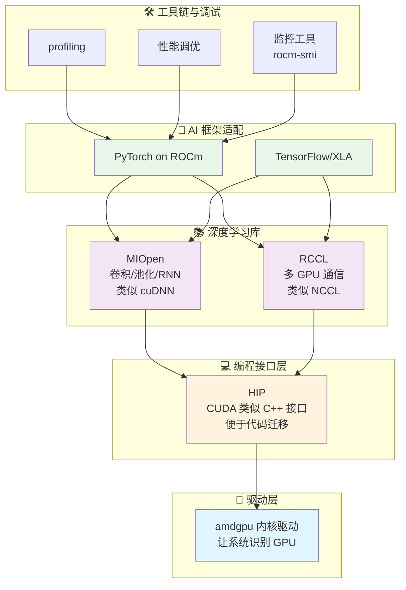

# 第 1 章：拥抱 AMD AI 算力新时代（前期准备）

<div align='center'>

[](https://rocm.docs.amd.com/)
[](https://pytorch.org/)

</div>

---

## 🎯 本章学习目标

本章的目标，是帮你搞清楚三件事：

1. ✅ **你的 AMD 设备能做什么**——从 Ryzen AI 本地 NPU，到 Radeon 独显、Instinct 加速卡的 AI 能力全景图
2. ✅ **ROCm 是什么**——为什么说它是 AI 的"基础设施"而不是单纯的"驱动"
3. ✅ **动手实战**——在 AMD 平台上用 PyTorch 跑通 ResNet 训练和 Qwen 3 大模型推理

***OK，那接下来我将会带领大家一步步探索 AMD AI 算力新时代，让我们一起来体验一下吧~***

---

## 1.1 你的 AMD 显卡能做什么？

> 💡 **小贴士**：过去我们谈 AI，几乎等于"英伟达 + CUDA"。现在这个格局已经被打破——AMD 从低功耗 AI PC，到桌面/工作站显卡，再到数据中心加速卡，形成了一条完整的 AI 产品线，并且统一在 ROCm 软件栈之下。

### 1.1.1 从 AI PC 到独立显卡的全景图

过去我们谈 AI，几乎等于“英伟达 + CUDA”。现在这个格局已经被打破：AMD 从低功耗 AI PC，到桌面/工作站显卡，再到数据中心加速卡，形成了一条完整的 AI 产品线，并且统一在 ROCm 软件栈之下。

可以把 AMD 的 AI 硬件大致分成三档来看：

### 🖥️ 1）AI PC：Ryzen AI（NPU + GPU）

以 2026 年的 **Ryzen AI 400 系列**为例，NPU 算力最高可达 **60 TOPS**，满足甚至超过微软 Copilot+ PC 的 40 TOPS 要求[1][2]。

一个典型的 Ryzen AI 400 芯片内部通常包含：

| 组件 | 功能 | 典型应用 |
| :--- | :--- | :--- |
| **Zen 5 CPU 核心** | 通用计算、数据预处理 | 数据预处理、逻辑控制 |
| **RDNA 3.5/4 集成 GPU** | 中等规模模型训练、小模型推理 | 7B 级别推理、LoRA 微调、图像/视频生成 |
| **XDNA 2 NPU** | 高效执行本地 AI 推理任务 | 语音识别、实时翻译、Copilot+ 功能 |


### 🎮 2）桌面/工作站：Radeon RX / Radeon Pro

对大部分开发者来说，入门友好的选择是 **Radeon RX 7000 / 9000 系列（RDNA 3 / RDNA 4）**：

| 类型 | 代表型号 | 特点 |
| :--- | :--- | :--- |
| **游戏卡** | Radeon RX 7700、RX 9070 等 | 性价比高，适合开发者和个人用户 |
| **专业卡** | Radeon AI PRO / Radeon Pro W 系列 | 显存更大、更稳定，适合专业工作 |

#### 🚀 RDNA 4 AI 加速亮点

RDNA 4 引入了更强的 AI 加速能力[3]：

- ✨ **每个 Compute Unit 内集成 2 个 AI 加速器**
- 📈 **AI 算力提升超过 4 倍**（相比上一代 RDNA 3）
- 💪 **千 TOPS 等级运算**（部分 9000 系列卡，搭配 16GB+ 显存）

#### 💼 桌面/工作站典型用法

- 🎨 本地 Stable Diffusion / ComfyUI 全流程
- 🤖 中等规模（7B–14B）LLM 推理与 LoRA 微调
- 🖼️ 图像分类、检测、分割等训练任务

### 🏢 3）数据中心：Instinct MI 系列

如果你在做大规模训练或部署 70B 甚至 400B 级别的模型，AMD 的 **Instinct MI300X / MI350X / MI355X** 系列是主力硬件[4][5]：

#### 💎 Instinct 系列核心优势

| 特性 | 说明 | 应用价值 |
| :--- | :--- | :--- |
| **超大显存** | 最高 **192GB HBM** 高带宽显存 | 支持超长上下文大模型（如 Qwen3-Coder-Next 80B） |
| **先进精度** | 支持 **FP8 精度、256k 上下文长度** | 满足最新代码模型和多模态模型需求[5] |
| **深度优化** | ROCm 7 在 Llama 3.x、GLM、DeepSeek 等模型上做了算子级优化 | 显著提升训练与推理吞吐[4] |

#### 🏭 使用场景

- 🔬 大模型训练（70B+）
- 🌐 多 GPU / 多节点推理集群
- 🏢 企业级 AI 服务平台

---

### 1.1.2 ROCm 生态现状：它不仅仅是"驱动"

> ⚠️ **重要认知**：很多人以为"装上 ROCm 就是装了驱动"，其实 ROCm 更像是一整套**开源 AI 计算平台**，类似"CUDA 生态"的 AMD 版本。

#### 🔧 ROCm 是什么？

ROCm（Radeon Open Compute）主要包含几层：



> 💡 **一句话总结**：**ROCm = AMD 版的 CUDA 生态 + 还更开放**

#### 🌟 ROCm 7.2 的几个关键点

根据 2026 年的官方信息和媒体报道[1][4][6]，ROCm 7.2 有几个对开发者很重要的变化：

| # | 特性 | 说明 |
| :--- | :--- | :--- |
| **1** | **🪟🐧 双平台正式支持** | Windows（Adrenalin 26.1.1）+ Linux（Ubuntu 等）一键安装 |
| **2** | **🎯 支持面扩展到消费级** | 不再局限数据中心，正式支持 Radeon RX 7000/9000 + Ryzen AI 300/400 |
| **3** | **⚡ 为 PyTorch 深度优化** | Llama、GLM、DeepSeek 等模型内核级优化，"装完就能用" |
| **4** | **🤝 与 Ubuntu 深度集成** | Ubuntu 26.04 LTS 起原生支持，长期稳定的 AI 环境[7] |

---

## 1.2 PyTorch on ROCm：无缝衔接

这一小节专注在三个核心问题：

| 问题 | 说明 |
| :--- | :--- |
| **📦 怎么装？** | pip install 背后的版本选择（稳定版 / Nightly / Windows） |
| **✅ 真的兼容吗？** | 为什么在 AMD 上 `torch.cuda.is_available()` 也是 True |
| **🚀 跑得动啥？** | 实战：ResNet 训练 Demo + Qwen 3 推理 Demo |

---

### 1.2.1 安装：pip install 里的玄机（官方 / nightly 如何选）

#### 📊 版本分层概览

PyTorch on ROCm 的包，通常可以分成三个层次：

#### 🔵 1. 稳定版（Stable）- AMD 官方推荐

> 💡 **重要说明**：AMD 推荐使用 **repo.radeon.com** 的 ROCm WHL 文件，而非 PyTorch.org 的版本（后者未经 AMD 充分测试）。

##### 📋 前置条件 [8]

- Python 3.12 环境
- Ubuntu 24.04 / 22.04

##### 安装步骤

**步骤 1：更新 pip**

```bash
# 安装 pip（如果尚未安装）
sudo apt install python3-pip -y

# 更新 pip 和 wheel
pip3 install --upgrade pip wheel
```

**步骤 2：下载并安装 PyTorch for ROCm**

Ubuntu 22.04 示例：

```bash
# 下载 WHL 文件
wget https://repo.radeon.com/rocm/manylinux/rocm-rel-7.2/torch-2.9.1%2Brocm7.2.0.lw.git7e1940d4-cp312-cp312-linux_x86_64.whl
wget https://repo.radeon.com/rocm/manylinux/rocm-rel-7.2/torchvision-0.24.0%2Brocm7.2.0.gitb919bd0c-cp312-cp312-linux_x86_64.whl
wget https://repo.radeon.com/rocm/manylinux/rocm-rel-7.2/triton-3.5.1%2Brocm7.2.0.gita272dfa8-cp312-cp312-linux_x86_64.whl
wget https://repo.radeon.com/rocm/manylinux/rocm-rel-7.2/torchaudio-2.9.0%2Brocm7.2.0.gite3c6ee2b-cp312-cp312-linux_x86_64.whl

# 卸载旧版本（如果存在）
pip3 uninstall torch torchvision triton torchaudio

# 安装新版本
pip3 install torch-2.9.1+rocm7.2.0.lw.git7e1940d4-cp312-cp312-linux_x86_64.whl \
  torchvision-0.24.0+rocm7.2.0.gitb919bd0c-cp312-cp312-linux_x86_64.whl \
  torchaudio-2.9.0+rocm7.2.0.gite3c6ee2b-cp312-cp312-linux_x86_64.whl \
  triton-3.5.1+rocm7.2.0.gita272dfa8-cp312-cp312-linux_x86_64.whl
```

> ⚠️ **注意**：在非虚拟环境的 Python 3.12 中安装时，必须添加 `--break-system-packages` 标志。

**步骤 3：验证安装**

```bash
# 验证 PyTorch 是否正确安装
python3 -c 'import torch' 2> /dev/null && echo 'Success' || echo 'Failure'

# 验证 GPU 是否可用
python3 -c 'import torch; print(torch.cuda.is_available())'

# 显示 GPU 设备名称
python3 -c "import torch; print(f'device name [0]:', torch.cuda.get_device_name(0))"

# 显示完整的 PyTorch 环境信息
python3 -m torch.utils.collect_env
```

**预期输出**：

```text
Success
True
device name [0]: AMD Radeon 8060S  # 或其他支持的 AMD GPU
```

> ✅ **适用场景**：生产环境和日常训练（AMD 官方推荐）

#### 🟡 2. Docker 安装（可选）

使用 Docker 可以提供更好的可移植性和预构建的容器环境。

**安装 Docker**：

```bash
sudo apt install docker.io
```

**拉取并运行 PyTorch Docker 镜像**（Ubuntu 24.04）：

```bash
# 拉取镜像
sudo docker pull rocm/pytorch:rocm7.2_ubuntu24.04_py3.12_pytorch_release_2.9.1

# 启动容器
sudo docker run -it \
  --cap-add=SYS_PTRACE \
  --security-opt seccomp=unconfined \
  --device=/dev/kfd \
  --device=/dev/dri \
  --group-add video \
  --ipc=host \
  --shm-size 8G \
  rocm/pytorch:rocm7.2_ubuntu24.04_py3.12_pytorch_release_2.9.1
```

> 💡 **提示**：可以使用 `-v` 参数挂载主机的数据目录到容器中。

#### 🔴 3. Windows 专用 ROCm SDK 轮子

对于 PyTorch on Windows + ROCm 7.2，AMD 官方提供了完整 wheel 链接[9]：
     - 先安装 ROCm SDK 组件（Python 3.12 环境）；
     - 再安装带 `+rocmsdk20260116` 标记的 torch/torchvision/torchaudio 轮子。
   - 典型命令（CMD 示例）：
     ```bat
     pip install --no-cache-dir ^
       https://repo.radeon.com/rocm/windows/rocm-rel-7.2/torch-2.9.1%2Brocmsdk20260116-cp312-cp312-win_amd64.whl ^
       https://repo.radeon.com/rocm/windows/rocm-rel-7.2/torchaudio-2.9.1%2Brocmsdk20260116-cp312-cp312-win_amd64.whl ^
       https://repo.radeon.com/rocm/windows/rocm-rel-7.2/torchvision-0.24.1%2Brocmsdk20260116-cp312-cp312-win_amd64.whl
     ```

#### 🎯 如何选择安装方式？

| 你的需求 | 推荐方案 | 说明 |
| :--- | :--- | :--- |
| **🔒 追求稳定（Linux）** | **repo.radeon.com WHL 文件** | AMD 官方推荐，经过充分测试 |
| **🐳 快速部署** | **Docker 镜像** | 预构建环境，开箱即用，跨平台 |
| **🚀 新硬件尝鲜** | **Nightly ROCm 轮子** | 新硬件支持 + 新功能，能接受偶尔踩坑 |
| **🪟 Windows 用户** | **AMD 官方 ROCm SDK** | Windows + Radeon + Ryzen AI 环境 |

---

### 1.2.2 兼容性揭秘：`torch.cuda.is_available()` 在 AMD 上也是 True？

> 🔍 **现象揭秘**：很多人第一次在 AMD GPU 上装好 PyTorch 后，运行验证代码发现 `torch.cuda.is_available()` 返回的是 **True**。这不是 bug，而是 **兼容性设计**。

很多人第一次在 AMD GPU 上装好 PyTorch 后，跑：

```python
import torch
print(torch.cuda.is_available())
print(torch.cuda.get_device_name(0))
print(torch.version.hip)
```

**结果发现**：

- `torch.cuda.is_available()` 返回的居然是 **True**；
- `torch.cuda.get_device_name(0)` 显示的是 **Radeon RX 9070 XT**、**Radeon PRO W7900** 或 **Instinct MI300X** 等；
- `torch.version.hip` 显示类似 `7.2.26015-fc0010cf6a`。

这不是 bug，而是 **兼容性设计**：

<div style="background: #fff3cd; border: 1px solid #ffc107; border-radius: 8px; padding: 16px; margin: 16px 0;">
  <div style="display: flex; align-items: start;">
    <span style="font-size: 20px; margin-right: 10px;">⚡</span>
    <div>
      <strong style="color: #856404;">为什么 torch.cuda 在 AMD 上也是 True？</strong><br>
      <span style="color: #856404; line-height: 1.6;">
        • PyTorch 生态（huggingface 等）依赖 <code>torch.cuda.*</code> API 判断 GPU<br>
        • 为了兼容性，ROCm 后端沿用了 <code>cuda</code> 命名空间<br>
        • 底层实际运行的是 <strong>HIP/ROCm</strong>，无需修改任何代码 ✨
      </span>
    </div>
  </div>
</div>


> ✅ **结论**：在 AMD 平台上：
> - `torch.cuda.*` ≈ "有 GPU 加速，底层是 ROCm/HIP"
> - `torch.version.rocm` 才是你真正查看 ROCm 版本的地方

---


